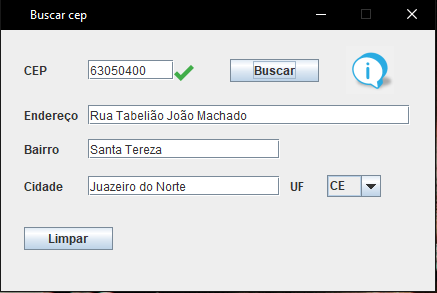
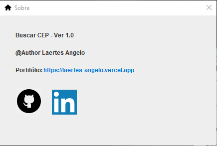

 <h1 align="center">Buscador de CEP</h1>

   

Este é um software em Java que é responsável que ao inserir qualquer CEP nele ele mostrara, rua, cidade, 
  estado e bairro. A segunda imagem é a janela 'Sobre' onde está presente a versão do projeto, criador e os links para meu portfólio, GitHub, e LinkedIn.

<h2 align="center">Tecnologias utilizada</h1>

  
  
          

     
<h2 align="center">Api de cep utilizada</h1>

<a href="https://www.republicavirtual.com.br/" target="_blank"> Republica Virtual</a>

